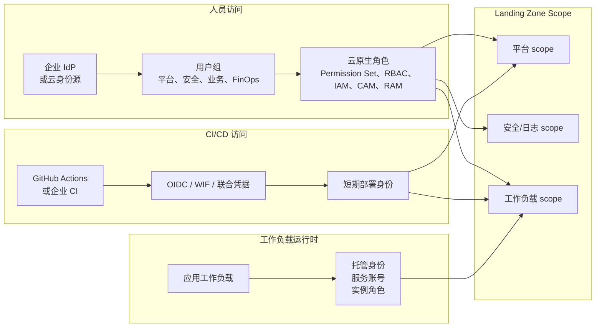

# 身份与访问流程图

本图区分人员访问、CI/CD 访问和工作负载运行时身份。

```mermaid
flowchart LR
  subgraph humans["人员访问"]
    idp["企业 IdP<br/>或云身份源"]
    groups["用户组<br/>平台、安全、业务、FinOps"]
    humanRoles["云原生角色<br/>Permission Set、RBAC、IAM、CAM、RAM"]
  end

  subgraph cicd["CI/CD 访问"]
    repo["GitHub Actions<br/>或企业 CI"]
    oidc["OIDC / WIF / 联合凭据"]
    deployer["短期部署身份"]
  end

  subgraph runtime["工作负载运行时"]
    workload["应用工作负载"]
    runtimeIdentity["托管身份<br/>服务账号<br/>实例角色"]
  end

  subgraph scopes["Landing Zone Scope"]
    platform["平台 scope"]
    security["安全/日志 scope"]
    workloadScopes["工作负载 scope"]
  end

  idp --> groups --> humanRoles
  humanRoles --> platform
  humanRoles --> security
  humanRoles --> workloadScopes

  repo --> oidc --> deployer
  deployer --> platform
  deployer --> workloadScopes

  workload --> runtimeIdentity --> workloadScopes
```

## 安全规则

- 人员权限基于组，不直接给个人授权。
- CI/CD 使用短期联合身份，不使用长期 Access Key 或 Client Secret。
- 工作负载身份限定在应用边界内。
- Break-glass 不属于常规路径，必须告警、过期并复盘。
