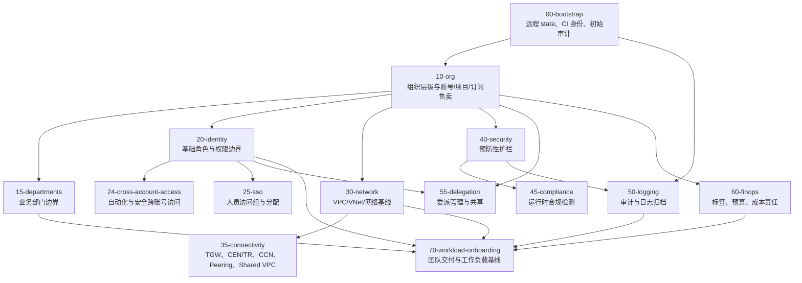

# Live Stack 流程图

本图展示推荐部署顺序和 state 边界。每个 live stack 都应有独立 backend key 或等价 state 路径。

## State 边界规则

- Bootstrap state 与后续所有 stack 隔离。
- 组织与安全策略 state 不应和工作负载接入混在一起。
- 网络互联 state 与账号/项目/订阅售卖 state 分离。
- State 地址迁移需要迁移计划；如果改变架构边界，还需要更新 ADR。
