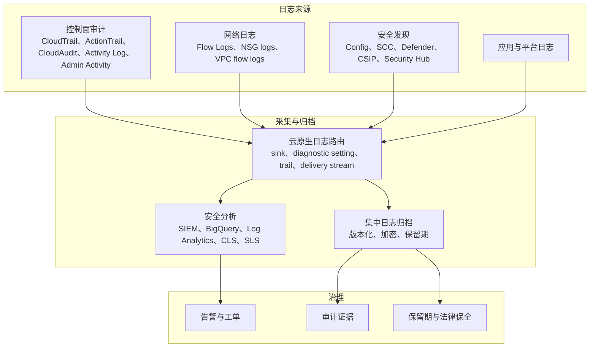

# 日志与审计流程图

本图展示每朵云 Landing Zone 期望具备的审计链路。

```mermaid
flowchart TD
  subgraph sources["日志来源"]
    controlPlane["控制面审计<br/>CloudTrail、ActionTrail、CloudAudit、Activity Log、Admin Activity"]
    networkLogs["网络日志<br/>Flow Logs、NSG logs、VPC flow logs"]
    securityFindings["安全发现<br/>Config、SCC、Defender、CSIP、Security Hub"]
    appLogs["应用与平台日志"]
  end

  subgraph collection["采集与归档"]
    logRouter["云原生日志路由<br/>sink、diagnostic setting、trail、delivery stream"]
    archive["集中日志归档<br/>版本化、加密、保留期"]
    analytics["安全分析<br/>SIEM、BigQuery、Log Analytics、CLS、SLS"]
  end

  subgraph governance["治理"]
    alerts["告警与工单"]
    evidence["审计证据"]
    retention["保留期与法律保全"]
  end

  controlPlane --> logRouter
  networkLogs --> logRouter
  securityFindings --> logRouter
  appLogs --> logRouter
  logRouter --> archive
  logRouter --> analytics
  analytics --> alerts
  archive --> evidence
  archive --> retention
```

## 基线规则

- 工作负载接入前必须启用控制面审计。
- 云厂商支持时，日志归档放在专用账号/项目/订阅/成员账号中。
- 日志写入权限和读取权限分离。
- 删除日志或修改保留期必须经过审批并留下审计证据。
