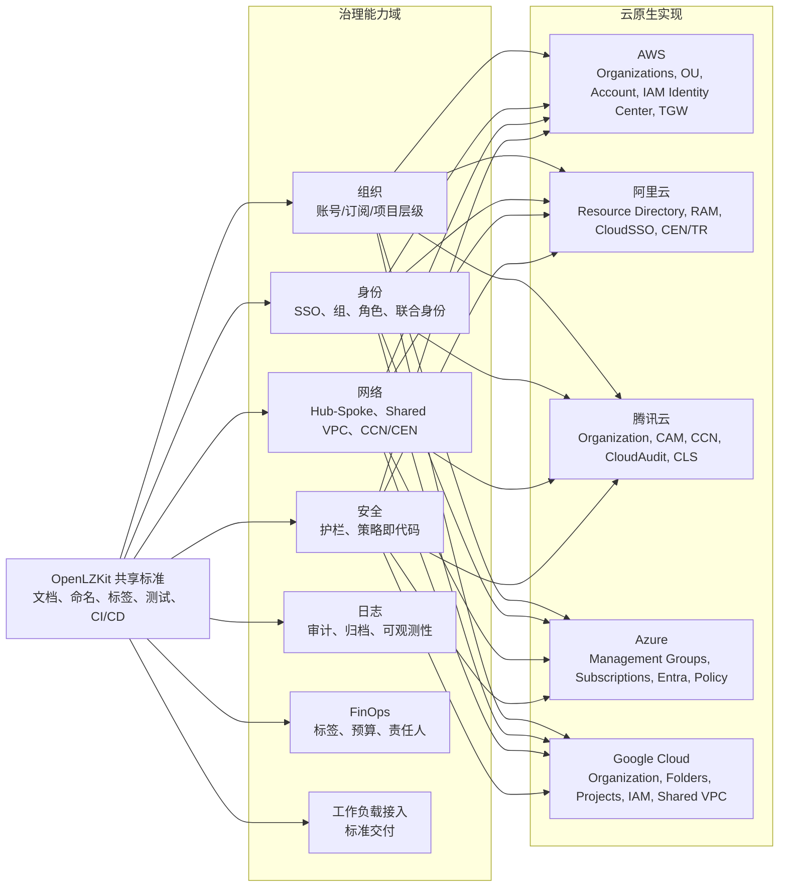

# 多云治理能力映射图

本图展示 OpenLZKit 共享治理能力域如何映射到各云原生实现。它刻意不使用统一资源抽象，避免掩盖云厂商差异。

```mermaid
flowchart LR
  standards["OpenLZKit 共享标准<br/>文档、命名、标签、测试、CI/CD"]

  subgraph domains["治理能力域"]
    org["组织<br/>账号/订阅/项目层级"]
    identity["身份<br/>SSO、组、角色、联合身份"]
    network["网络<br/>Hub-Spoke、Shared VPC、CCN/CEN"]
    security["安全<br/>护栏、策略即代码"]
    logging["日志<br/>审计、归档、可观测性"]
    finops["FinOps<br/>标签、预算、责任人"]
    workload["工作负载接入<br/>标准交付"]
  end

  subgraph clouds["云原生实现"]
    aws["AWS<br/>Organizations, OU, Account, IAM Identity Center, TGW"]
    alicloud["阿里云<br/>Resource Directory, RAM, CloudSSO, CEN/TR"]
    tencent["腾讯云<br/>Organization, CAM, CCN, CloudAudit, CLS"]
    azure["Azure<br/>Management Groups, Subscriptions, Entra, Policy"]
    gcp["Google Cloud<br/>Organization, Folders, Projects, IAM, Shared VPC"]
  end

  standards --> org
  standards --> identity
  standards --> network
  standards --> security
  standards --> logging
  standards --> finops
  standards --> workload

  org --> aws
  org --> alicloud
  org --> tencent
  org --> azure
  org --> gcp
  identity --> aws
  identity --> alicloud
  identity --> tencent
  identity --> azure
  identity --> gcp
  network --> aws
  network --> alicloud
  network --> tencent
  network --> azure
  network --> gcp
  security --> aws
  security --> alicloud
  security --> tencent
  security --> azure
  security --> gcp
```

## 评审问题

- 新功能是否属于已有治理能力域，还是需要新增能力域？
- 实现是否尊重云原生模型，还是把其他云的模型硬套过来？
- 共享标准是否更新，同时避免创建共享资源抽象？
