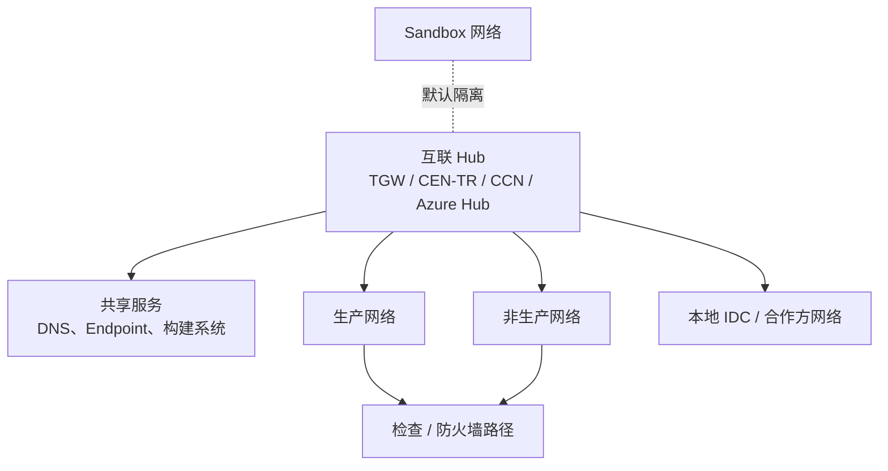
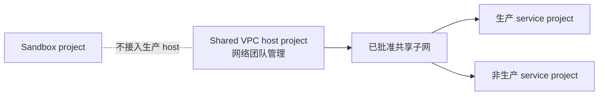

# 网络拓扑图

OpenLZKit 使用各云原生网络模式，而不是强行抽象成单一网络模型。

## Hub-Spoke 与 Transit 模式

适用于 AWS Transit Gateway、阿里云 CEN/TR、腾讯云 CCN 和 Azure Hub-Spoke/Virtual WAN。

## Google Cloud Shared VPC 模式

## 评审问题

- CIDR 是否不重叠？
- Sandbox 是否默认与生产隔离？
- 路由表关联和传播是否显式声明？
- DNS 是否和 Private Endpoint / Private Service Access 一起设计？
- 受监管环境是否启用 Flow Logs 或等价网络日志？
