# AWS Landing Zone 图解导览

本文用 AWS 作为样板，把 Landing Zone 的设计、规划、依赖关系和角色关系讲清楚。它面向第一次系统学习 Landing Zone 的读者：先看图形成整体感，再读每一步背后的原理。

更深入的实现细节见：

- [AWS Landing Zone Design](../../multi-cloud/aws/docs/design.md)
- [AWS Account Model](../../multi-cloud/aws/docs/account-model.md)
- [AWS Identity Model](../../multi-cloud/aws/docs/identity-model.md)
- [AWS Network Model](../../multi-cloud/aws/docs/network-model.md)
- [AWS Security Baseline](../../multi-cloud/aws/docs/security-baseline.md)
- [AWS Cross-account Access Model](../../multi-cloud/aws/docs/cross-account-access-model.md)
- [AWS Compliance Model](../../multi-cloud/aws/docs/compliance-model.md)
- [AWS FinOps Model](../../multi-cloud/aws/docs/finops-model.md)
- [AWS workload onboarding model](../../multi-cloud/aws/docs/workload-onboarding-model.md)

## 1. 一句话理解

AWS Landing Zone 不是“创建几个 AWS 账号”，而是先搭好一套企业云上地基：

- 用 AWS Organizations 和 OU 管账号边界。
- 用 IAM Identity Center、IAM Role、STS 和 OIDC 管访问路径。
- 用 VPC、Transit Gateway 和 RAM 管网络连接。
- 用 SCP、Tag Policy、Config、Security Hub 和 GuardDuty 管安全与合规。
- 用 CloudTrail、S3 Object Lock、KMS 和 Security Lake 管审计证据。
- 用 Budgets、Cost Categories、CUR 和 QuickSight 管成本责任。
- 用 Terraform/OpenTofu live stack 把这些能力按依赖顺序交付。

核心原则：

```text
账号是隔离边界，OU 是策略继承边界，角色是访问边界，日志是审计边界，标签是成本边界。
```

## 2. 总览图

这张图先把全局关系放在一起。读 Landing Zone 时不要只盯某个服务，要先看这些层如何互相支撑。

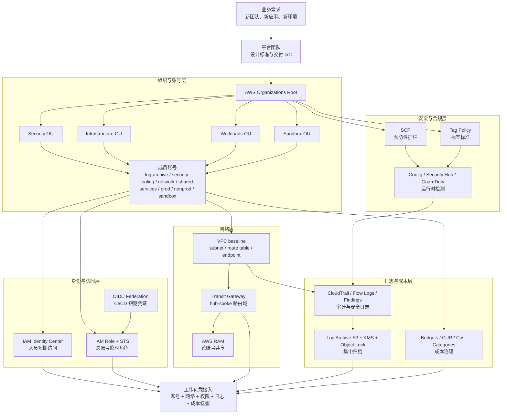

## 3. 账号与 OU：先把“房间”分清楚

AWS 里最重要的隔离单位是 Account。一个账号里出了权限、网络、预算或安全事故，理想情况下不应该影响其他账号。

OU 是账号的分组和策略继承边界。SCP、Tag Policy、账号售卖、成本归集和访问分配都可以稳定附着到 OU 或账号。

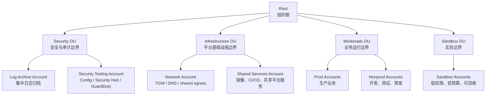

### 为什么这样分

| 层级 | 作用 | 设计逻辑 |
|---|---|---|
| Root | 组织根 | 只放全局治理，不承载业务 |
| Security OU | 安全与审计 | 日志、检测、合规需要独立于业务账号 |
| Infrastructure OU | 共享基础设施 | 网络、共享服务由平台集中管理 |
| Workloads OU | 业务环境 | 按生产与非生产隔离风险和权限 |
| Sandbox OU | 实验环境 | 允许学习和试错，但预算和权限更低 |

专业术语：

- **Account**：AWS 资源隔离边界，也是账单、权限和安全事件的重要边界。
- **OU**：Organizational Unit，组织单元。用于分组账号并继承组织策略。
- **Management Account**：组织管理账号。负责组织编排，不应承载业务资源。
- **Member Account**：成员账号。承载安全、网络、共享服务或业务资源。

## 4. 部署阶段：为什么必须按顺序来

Landing Zone 是分层系统。后面的层依赖前面的标识、账号、角色、网络和日志目的地。

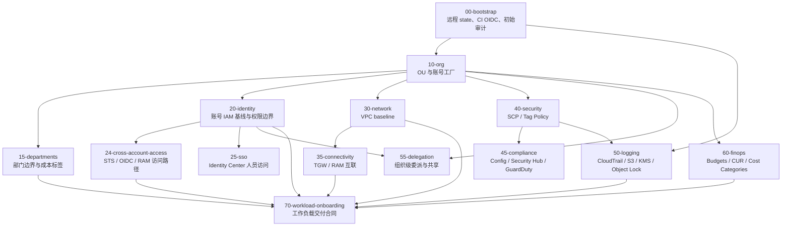

### 阶段说明

| 阶段 | 做什么 | 依赖 | 产出 | 为什么 |
|---|---|---|---|---|
| `00-bootstrap` | 建远程 state、CI 身份、初始审计 | 初始管理账号 | backend、OIDC 角色、基础日志 | 后续所有 IaC 要有可追踪状态和短期凭证 |
| `10-org` | 建 OU、售卖或导入账号 | bootstrap | OU id、account id | 其他层都要知道资源落在哪个账号 |
| `15-departments` | 建业务部门边界 | org | 部门 OU、标签、部门角色 | 成本、权限、账号申请要有业务归属 |
| `20-identity` | 建账号 IAM 基线 | org | 权限边界、账号 alias、基础 policy | 先约束账号内最大权限 |
| `24-cross-account-access` | 建跨账号角色和 OIDC | identity | STS role、OIDC provider、RAM share | 自动化、安全、网络都需要临时访问目标账号 |
| `25-sso` | 分配人员访问 | identity、org | permission set、group assignment | 人员不在成员账号里创建 IAM user |
| `30-network` | 建 VPC 与子网 | org | VPC、subnet、route table、endpoint | 业务需要先有标准网络落点 |
| `35-connectivity` | 建 TGW 与互联 | network | attachment、route table、RAM share | 跨账号网络必须集中、显式、可审计 |
| `40-security` | 建 SCP 与 Tag Policy | org | 预防性护栏 | 先阻断高风险动作，再让业务接入 |
| `45-compliance` | 建运行时检测 | security、logging | Config、Security Hub、GuardDuty | SCP 不能发现所有运行时风险 |
| `50-logging` | 建集中审计归档 | bootstrap、security | CloudTrail、日志桶、KMS、对象锁 | 没有日志，就没有审计证据 |
| `55-delegation` | 建委派管理 | org、identity | delegated admin、共享资源关系 | 让安全、网络等能力由专用账号管理 |
| `60-finops` | 建成本治理 | org、departments | 预算、异常检测、CUR、成本分类 | 账号和标签确定后才能可靠归集成本 |
| `70-workload-onboarding` | 交付工作负载合同 | 前面所有关键层 | 账号、网络、权限、日志、成本元数据 | 业务拿到的是受控环境，不是裸账号 |

## 5. 身份分层：同一个“人”不要直接等于“管理员”

企业权限设计不要从“张三是谁”开始，而要从“主体、角色、范围、条件”开始。

```text
Principal = 谁发起访问
Role      = 能做什么
Scope     = 在哪里做
Condition = 什么条件下做
```

### 身份关系图

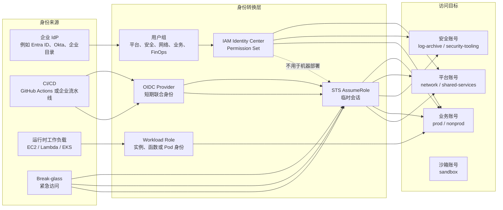

### 统一角色模型

| 角色 | 谁使用 | AWS 表达 | 主要范围 | 关键约束 |
|---|---|---|---|---|
| `platform-admin` | 平台团队 | Permission Set / IAM Role | infrastructure、shared services | 生产 JIT，避免常态 Administrator |
| `security-auditor` | 安全团队 | Permission Set / IAM Role | 所有账号只读审计 | 只读，不直接改业务资源 |
| `network-admin` | 网络团队 | Permission Set / IAM Role | network account、TGW、RAM | 不拥有业务数据权限 |
| `workload-poweruser` | 业务团队 | Permission Set | 指定业务账号 | 非生产可宽，生产需审批 |
| `cicd-planner` | CI/CD | OIDC + STS Role | plan、读取 state、读取配置 | 不允许 apply |
| `cicd-deployer` | CI/CD | OIDC + STS Role | 指定环境 apply | 限制 repo、branch、environment |
| `finance-viewer` | 财务/负责人 | Permission Set | 成本、预算、CUR | 只读成本数据 |
| `break-glass-admin` | 少数负责人 | 专用 Role | 故障恢复范围 | MFA、短会话、强告警、事后复盘 |

### 为什么人员和机器要分开

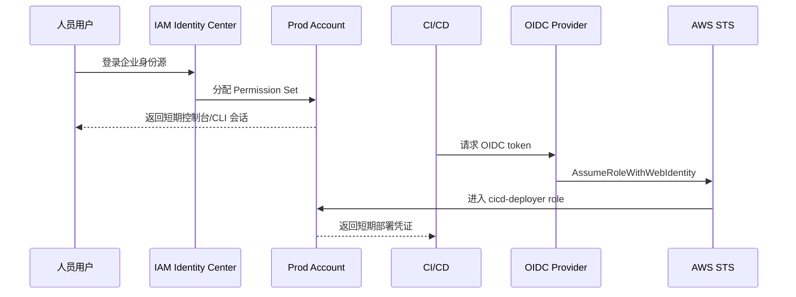

人员访问用于运维、排障和审批后的变更；机器访问用于自动化 plan/apply。两者都应该是短期凭证，但入口、审计语义和权限边界不同。

## 6. 跨账号访问：不要复制密钥，要扮演角色

跨账号访问的关键是目标账号创建 Role，来源主体通过信任策略进入这个 Role。

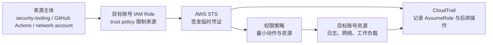

必须控制的点：

- Trust policy 不允许 `Principal = "*"`.
- OIDC role 要限制 `aud`、`sub`、repo、branch、environment。
- 第三方或跨组织访问优先使用 `ExternalId`。
- 权限策略只给目标场景需要的 API。
- CloudTrail 必须记录 AssumeRole 和后续资源操作。

## 7. 网络：用 TGW 做清晰的路由域

网络层的目标不是“所有 VPC 都互通”，而是“该通的明确通，不该通的明确不通”。

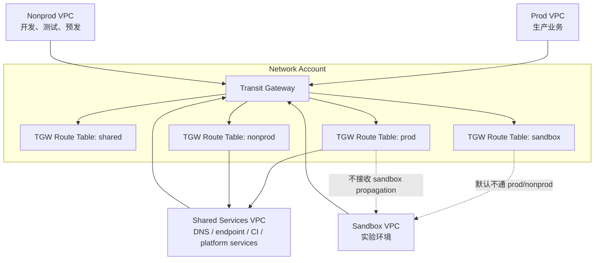

设计逻辑：

- `30-network` 先在账号内建 VPC、子网、路由表、endpoint 和 flow logs。
- `35-connectivity` 再用 TGW 和 RAM 做跨账号互联。
- TGW 默认 route table association 和 propagation 不应隐式打开。
- sandbox 默认不能到 prod。
- 业务账号之间不要随意 VPC peering，互联应集中在 network account。

专业术语：

- **Hub-Spoke**：中心网络账号作为 hub，业务 VPC 作为 spoke。
- **Transit Gateway**：AWS 的区域级网络中转服务，用于连接 VPC、VPN、Direct Connect 等。
- **Association**：一个 attachment 关联到哪张 TGW route table。
- **Propagation**：一个 attachment 的路由是否传播到某张 TGW route table。
- **AWS RAM**：Resource Access Manager，用于跨账号共享 TGW 等资源。

## 8. 安全：预防、检测、审计三层一起工作

安全治理不是一个服务完成的。SCP 负责“提前拦”，Config/Security Hub/GuardDuty 负责“持续发现”，CloudTrail 和日志归档负责“留下证据”。

```mermaid
flowchart TD
  change["变更请求<br/>Terraform plan / 控制台操作 / API"]

  subgraph prevention["预防性控制"]
    scp["SCP<br/>禁止关闭审计、限制 Region、禁止高危动作"]
    tagPolicy["Tag Policy<br/>统一标签键和值域"]
    conftest["Conftest / Rego<br/>PR 阶段检查 plan"]
  end

  subgraph detection["检测性控制"]
    config["AWS Config<br/>配置变更与规则"]
    hub["Security Hub<br/>安全发现聚合"]
    duty["GuardDuty<br/>威胁检测"]
  end

  subgraph evidence["证据层"]
    trail["CloudTrail<br/>控制面审计"]
    archive["Log Archive<br/>S3 + KMS + Object Lock"]
  end

  change --> conftest
  change --> scp
  change --> tagPolicy
  scp --> config
  tagPolicy --> config
  config --> hub
  duty --> hub
  change --> trail
  hub --> archive
  trail --> archive
```

### 三层职责

| 层 | 典型能力 | 回答的问题 |
|---|---|---|
| 预防 | SCP、Tag Policy、Rego、permission boundary | 这个动作是否应该被允许发生 |
| 检测 | Config、Security Hub、GuardDuty | 已经存在的资源是否持续合规 |
| 证据 | CloudTrail、日志桶、对象锁、KMS | 谁在什么时候做了什么，证据是否可信 |

常见误区：

- 只写安全规范，不做 policy-as-code，无法在 PR 阶段拦截风险。
- 只开 Config，不开 SCP，高危动作仍可能先发生。
- 只在本账号存日志，账号被破坏时证据也可能被删。
- Tag Policy 不等于所有服务都被强制拒绝，仍需 SCP、Config 和 CI 检查配合。

## 9. 日志：审计证据要离开业务账号

集中日志不是为了“方便看日志”这么简单，而是为了让事故发生后仍能证明事实。

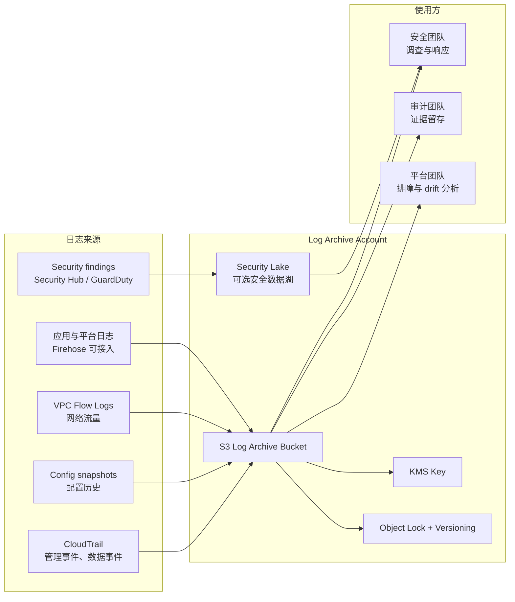

日志层的关键点：

- 日志写入权限和读取权限分离。
- log archive account 不承载业务资源。
- 日志桶启用加密、版本化、Public Access Block 和保留策略。
- 生产启用 Object Lock 前要提前规划，因为它通常需要在 bucket 创建时开启。
- 删除日志、缩短保留期、关闭 CloudTrail 都应该被 SCP 和审计流程约束。

## 10. FinOps：标签不是装饰，是成本合同

FinOps 的底层逻辑是：每一笔成本都应该能追到业务、环境、项目、负责人和数据级别。

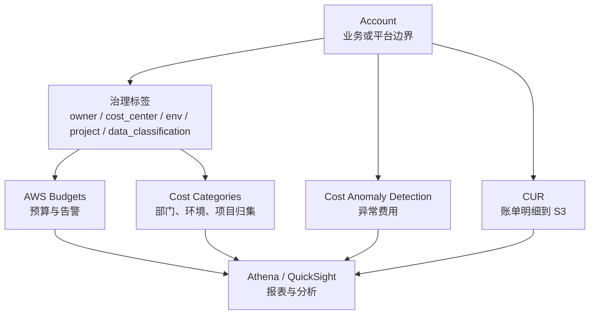

成本治理规则：

- 账号创建时就要求 owner、cost center、env、project 等标签。
- sandbox 应有低预算和告警，必要时配合回收策略。
- prod 通常告警优先，不应简单自动停机。
- CUR 提供明细证据，QuickSight 或第三方平台负责展示和分析。
- 成本分类规则要和 OU、账号命名、标签策略保持一致。

## 11. 工作负载接入：业务拿到的是“合同”，不是裸账号

最后的 `70-workload-onboarding` 不是再创建一套基础设施，而是把前面所有层的产出整理成业务可使用的交付合同。

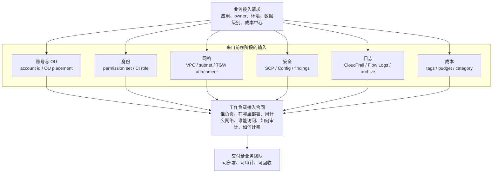

接入合同至少应包含：

- 业务部门、owner、cost center、environment、project。
- 数据分级和服务等级。
- 目标账号、OU、VPC、subnet、endpoint 和 TGW 引用。
- 人员 permission set 和 CI/CD role。
- 日志、审计、Config、Security Hub 和 GuardDuty 状态。
- 预算、成本分类和标签要求。
- SSM Parameter Store 或等价元数据路径，供审计和自动化发现。

## 12. 用一个比喻记住整体逻辑

可以把 AWS Landing Zone 想成一座企业园区：

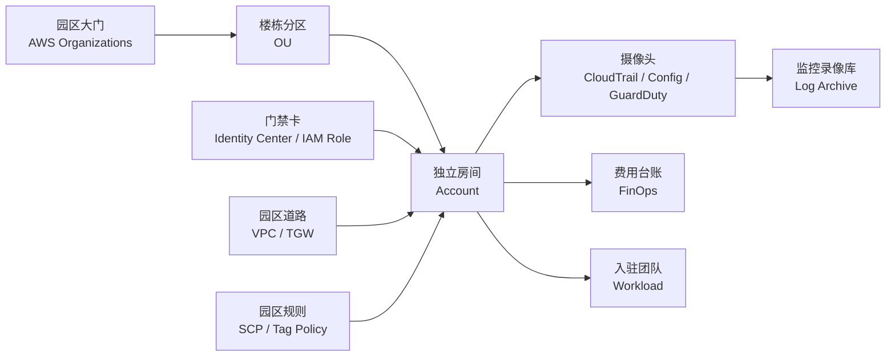

这个比喻的重点不是卡通化，而是帮助记住专业关系：

- 没有房间划分，权限和风险会混在一起。
- 没有门禁卡，人员和机器访问无法审计。
- 没有道路规划，网络会变成随意互通。
- 没有园区规则，高风险动作只能事后补救。
- 没有录像库，事故后无法还原事实。
- 没有费用台账，云成本无法归属。

## 13. 最小可用 AWS Landing Zone 检查清单

| 领域 | 最小验收 |
|---|---|
| 组织 | 有 Security、Infrastructure、Workloads、Sandbox OU |
| 账号 | 有 log archive、security tooling、network、shared services、prod/nonprod/sandbox 账号规划 |
| 身份 | 人员走 IAM Identity Center，机器走 OIDC/STS |
| 权限 | 有最小权限角色、permission boundary、break-glass 流程 |
| 网络 | 有 VPC baseline、TGW 路由域、sandbox 与 prod 隔离 |
| 安全 | 有 SCP、Tag Policy、Config、Security Hub、GuardDuty |
| 日志 | 有组织级 CloudTrail、集中日志桶、KMS、版本化和保留策略 |
| 成本 | 有必填标签、预算、成本分类、CUR 明细 |
| IaC | 每个 live stack 独立 state，PR 经过 fmt、validate、tflint、checkov、conftest |
| 接入 | 业务交付合同包含账号、网络、权限、日志、成本和 owner |

## 14. 学习路径

建议按下面顺序学习和实现：

1. 先读本文，理解整体层级和依赖。
2. 读 [AWS Account Model](../../multi-cloud/aws/docs/account-model.md)，理解账号与 OU。
3. 读 [AWS Identity Model](../../multi-cloud/aws/docs/identity-model.md) 和 [AWS Cross-account Access Model](../../multi-cloud/aws/docs/cross-account-access-model.md)，理解人员与机器身份。
4. 读 [AWS Network Model](../../multi-cloud/aws/docs/network-model.md)，理解 VPC、TGW 和 RAM。
5. 读 [AWS Security Baseline](../../multi-cloud/aws/docs/security-baseline.md)、[AWS Compliance Model](../../multi-cloud/aws/docs/compliance-model.md) 和 [AWS Logging And Operations Runbook](../../multi-cloud/aws/docs/operations-runbook.md)，理解预防、检测和证据。
6. 读 [AWS FinOps Model](../../multi-cloud/aws/docs/finops-model.md)，理解成本责任。
7. 最后读 [AWS workload onboarding model](../../multi-cloud/aws/docs/workload-onboarding-model.md)，理解业务如何接入。

面试或方案汇报时，可以这样总结：

> AWS Landing Zone 的核心是用 Organizations/OU/Account 建隔离边界，用 IAM Identity Center 与 STS/OIDC 建短期访问路径，用 VPC/TGW/RAM 建集中网络，用 SCP/Tag Policy 做预防性护栏，用 Config/Security Hub/GuardDuty 做运行时检测，用 CloudTrail/Log Archive 保留审计证据，用 Budgets/CUR/Cost Categories 建成本责任，最后通过 workload onboarding contract 把受控环境交付给业务团队。
